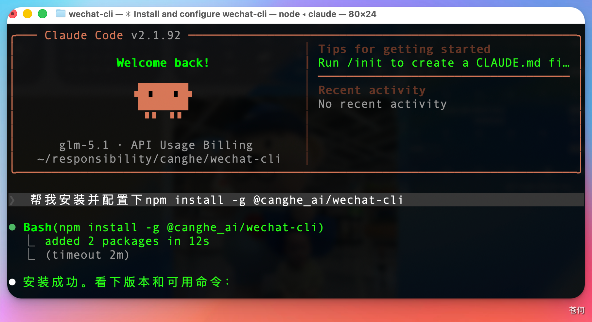
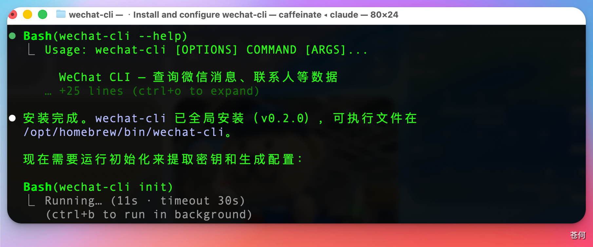
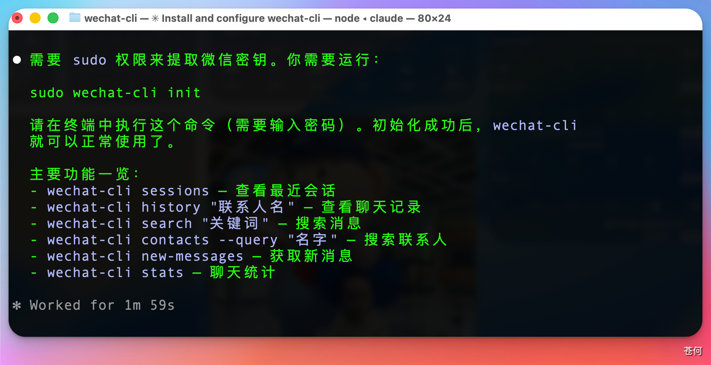
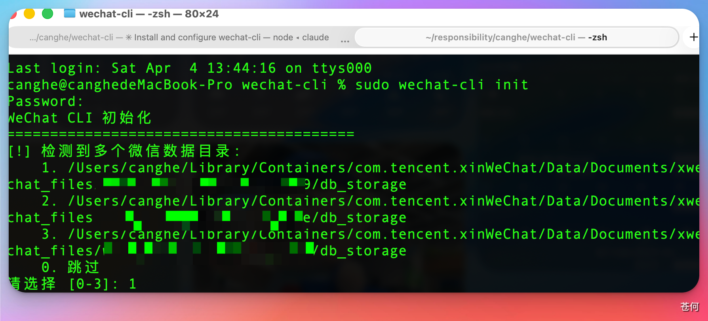
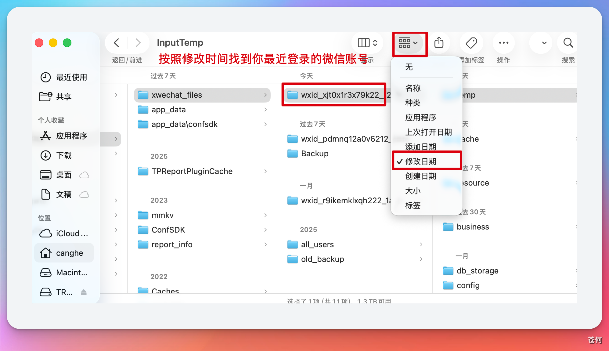

<div align="center">

# WeChat CLI

**Local WeChat data access for people and AI agents, with a productized Windows 0.5.0 line.**

[](https://www.npmjs.com/package/@canghe_ai/wechat-cli)
[](https://opensource.org/licenses/Apache-2.0)
[](https://github.com/AuRevior-ai/wechat-cli)

Chat history · Merged forwards · Voice transcription · AI media packages

[中文文档](README_CN.md)

Maintained by **Au Revior**.

</div>

---

## ✨ Highlights

- **AI-first local data access** — structured JSON, text export, search, analytics, and AI-ready media packages.
- **Local Web console** — chat workflows, invite statistics, exports, and local management surfaces.
- **Windows 0.5.0 product line** — WebView2 Launcher, licensed devices, signed updates, health checks, and rollback.
- **Local-first processing** — WeChat database access and chat processing stay on the machine unless the user explicitly submits diagnostics.
- **Read-only message access** — the tool queries local data and does not send, modify, or delete WeChat messages.

---

## Distribution and version lines

| Channel | Current repository version | Availability |
|---|---:|---|
| Python/source and Windows product line | 0.5.0 | Source checkout; Windows licensed builds are distributed through the private release system |
| Existing npm wrapper | 0.2.4 | Existing npm package, currently carrying the macOS arm64 platform package |

These lines are not synchronized. The npm badge reports the npm channel, not the Windows/Python product version.

## 📥 Installation (For Humans)

AI Agents — skip ahead to "Installation (For AI Agents)" below.

### Existing npm channel (0.2.4)

```bash
npm install -g @canghe_ai/wechat-cli
```

> This command installs the existing npm 0.2.4 line, which currently carries the macOS arm64 platform package. It does not install the Windows/Python 0.5.0 product line.

**Update to the latest version:**

```bash
npm update -g @canghe_ai/wechat-cli
```

### Existing Python package channel

```bash
pip install wechat-cli
```

Requires Python >= 3.10. The version published on the package index may differ from the current repository version.

### From Source

```bash
git clone https://github.com/AuRevior-ai/wechat-cli.git
cd wechat-cli
pip install -e .
```

---

## 📥 Installation (For AI Agents)

Simply paste the following prompt into Claude Code, OpenClaw, or any AI coding agent:

```bash
帮我配置并安装：npm install -g @canghe_ai/wechat-cli
```

For example, in Claude Code:



Note: Make sure you have Node.js installed first. You can ask your agent to set it up if needed.

---

## 🚀 Quick Start

### Step 1 — Initialize

Make sure WeChat is running, then:

```bash
# macOS/Linux: may need sudo for memory scanning
sudo wechat-cli init

# Windows: run in a terminal with sufficient privileges
wechat-cli init
```

This auto-detects your WeChat data directory, extracts encryption keys, and saves config to `~/.wechat-cli/`.



On macOS, you'll need to run the `sudo` command and enter your password:



If you have multiple WeChat accounts logged in locally, you'll be prompted to choose one. Select the account you're currently using (the default is the first one):



If you're unsure which WeChat account is currently active, navigate to the data folder and sort by modification date to find out:



#### macOS: Grant Full Disk Access to Terminal

Before running `init`, make sure your terminal app has **Full Disk Access**:

1. Open **System Settings → Privacy & Security → Full Disk Access**
2. Add your terminal app (e.g. Terminal, iTerm2, or the terminal in your IDE)
3. Restart the terminal after enabling

Without this permission, the tool cannot access WeChat's data directory and key extraction will fail.

#### macOS: `task_for_pid failed` Error

On some macOS systems, `init` may fail with `task_for_pid failed` even when running with `sudo`. This is due to macOS security restrictions on process memory access.

**WeChat CLI will automatically attempt to fix this** by re-signing WeChat with the required entitlement (original entitlements are preserved). Just follow the on-screen instructions:

1. The tool will re-sign WeChat automatically
2. Quit WeChat completely (not just minimize)
3. Reopen WeChat and log in
4. Run `sudo wechat-cli init` again

If auto re-signing fails, you can do it manually:

```bash
# Quit WeChat first, then:
sudo codesign --force --sign - --entitlements /dev/stdin /Applications/WeChat.app <<'EOF'
<?xml version="1.0" encoding="UTF-8"?>
<!DOCTYPE plist PUBLIC "-//Apple//DTD PLIST 1.0//EN" "http://www.apple.com/DTDs/PropertyList-1.0.dtd">
<plist version="1.0">
<dict>
    <key>com.apple.security.get-task-allow</key>
    <true/>
</dict>
</plist>
EOF
```

> **Heads up:** Re-signing WeChat is safe and will **not** cause account issues or bans. However, it may affect WeChat's auto-update mechanism. If you notice any feature not working properly, or want to update WeChat to the latest version, simply re-download and reinstall WeChat from the [official website](https://mac.weixin.qq.com/) — no need to re-run `init`, your existing config and keys will continue to work.

### Step 2 — Use It

```bash
wechat-cli sessions                        # Recent chats
wechat-cli history "Alice" --limit 20      # Chat messages
wechat-cli search "deadline" --chat "Team" # Search messages
wechat-cli ai-package "Team" --start-time "2026-07-29" --end-time "2026-07-29" --output team-ai.zip
```

---

## 🤖 Using with AI Agents

WeChat CLI is designed as an AI agent tool. All commands output structured JSON by default.

### Claude Code

Add to your project's `CLAUDE.md`:

```markdown
## WeChat CLI

You can use `wechat-cli` to query my local WeChat data.

Common commands:
- `wechat-cli sessions --limit 10` — list recent chats
- `wechat-cli history "NAME" --limit 20 --format text` — read chat history
- `wechat-cli search "KEYWORD" --chat "CHAT_NAME"` — search messages
- `wechat-cli contacts --query "NAME"` — search contacts
- `wechat-cli unread` — show unread sessions
- `wechat-cli new-messages` — get messages since last check
- `wechat-cli members "GROUP"` — list group members
- `wechat-cli stats "CHAT" --format text` — chat statistics
- `wechat-cli invite-stats "GROUP" --format text` — group invitation statistics
- `wechat-cli ai-package "CHAT" --output chat-ai.zip` — build an AI-ready text and media package
- `wechat-cli media export PATH --output-dir exported-media` — process a local media path returned by history
- `wechat-cli web --open` — start the local Web console
```

Then in conversation you can ask Claude things like:
- "Check my unread WeChat messages"
- "Search for messages about the project deadline in the Team group"
- "Who sent the most messages in the AI group this week?"

### OpenClaw / MCP Integration

WeChat CLI works with any AI tool that can execute shell commands:

```bash
# Get recent conversations
wechat-cli sessions --limit 5

# Read specific chat
wechat-cli history "Alice" --limit 30 --format text

# Search with filters
wechat-cli search "report" --type file --limit 10

# Monitor for new messages (great for cron/automation)
wechat-cli new-messages --format text
```

---

## 📖 Command Reference

### `sessions` — Recent Chats

```bash
wechat-cli sessions                        # Last 20 sessions
wechat-cli sessions --limit 10             # Last 10
wechat-cli sessions --format text          # Human-readable
```

### `history` — Chat Messages

```bash
wechat-cli history "Alice"                 # Last 50 messages
wechat-cli history "Alice" --limit 100 --offset 50
wechat-cli history "Team" --start-time "2026-04-01" --end-time "2026-04-03"
wechat-cli history "Alice" --type link     # Only links
wechat-cli history "Alice" --format text
```

**Options:** `--limit`, `--offset`, `--start-time`, `--end-time`, `--type`, `--format`

### `ai-package` — AI-ready chat and media ZIP

```bash
wechat-cli ai-package "Team" --start-time "2026-07-29" --end-time "2026-07-29" --output team-ai.zip
wechat-cli ai-package "Alice" --output alice-ai.zip --no-transcribe-voice
```

The ZIP contains `聊天记录.txt`, `清单.json`, and a relative `素材/` directory.
Merged forwards are expanded recursively. Local images and WeChat stickers are
saved with deterministic filenames. SILK voice messages are decoded to WAV and,
by default, transcribed with a SHA-256-verified offline sherpa-onnx model.

On Windows WeChat 4.1, V2 image keys are briefly present after an image is
opened full-size in WeChat. If a package reports an unavailable V2 image, open
that image in WeChat and run the command again; verified keys are cached locally.

**Options:** `--start-time`, `--end-time`, `--output`, `--transcribe`,
`--no-transcribe-voice`, `--include-copy-data`

### `search` — Search Messages

```bash
wechat-cli search "hello"                  # Global search
wechat-cli search "hello" --chat "Alice"   # In specific chat
wechat-cli search "meeting" --chat "TeamA" --chat "TeamB"  # Multiple chats
wechat-cli search "report" --type file     # Only files
```

**Options:** `--chat` (repeatable), `--start-time`, `--end-time`, `--limit`, `--offset`, `--type`, `--format`

### `contacts` — Contact Search & Details

```bash
wechat-cli contacts --query "Li"           # Search contacts
wechat-cli contacts --detail "Alice"       # Contact details
wechat-cli contacts --detail "wxid_xxx"    # By WeChat ID
```

Returns: nickname, remark, WeChat ID, bio, avatar URL, account type.

### `members` — Group Members

```bash
wechat-cli members "Team Group"            # All members (JSON)
wechat-cli members "Team Group" --format text
```

### `stats` — Chat Statistics

```bash
wechat-cli stats "Team Group"
wechat-cli stats "Alice" --start-time "2026-04-01" --end-time "2026-04-03"
wechat-cli stats "Team Group" --format text
```

Returns: total messages, type breakdown, top 10 senders, 24-hour activity distribution.

### `invite-stats` — Group invitation statistics

```bash
wechat-cli invite-stats "Group Name"
wechat-cli invite-stats "Group Name" --format text
wechat-cli invite-stats "Group Name" --format csv --output invite-stats.csv
wechat-cli invite-stats "Group Name" --bind-identity "Historical Name=wxid_xxx"
```

The command parses invitation system notices, ranks inviters by unique invitees, and keeps event details for auditing. Identity resolution uses exact evidence; similar names are not merged automatically. Notices without a confirmed source remain source-unknown and are excluded from the ranking. Repeat `--bind-identity` to map a historical name to a stable account explicitly.

### `export` — Export Conversations

```bash
wechat-cli export "Alice" --format markdown              # To stdout
wechat-cli export "Alice" --format txt --output chat.txt  # To file
wechat-cli export "Team" --start-time "2026-04-01" --limit 1000
```

**Options:** `--format markdown|txt`, `--output`, `--start-time`, `--end-time`, `--limit`

### `favorites` — WeChat Bookmarks

```bash
wechat-cli favorites                       # Recent bookmarks
wechat-cli favorites --type article        # Articles only
wechat-cli favorites --query "machine learning"  # Search
```

**Types:** text, image, article, card, video

### `unread` — Unread Sessions

```bash
wechat-cli unread                          # All unread sessions
wechat-cli unread --limit 10 --format text
```

### `new-messages` — Incremental New Messages

```bash
wechat-cli new-messages                    # First: return unread + save state
wechat-cli new-messages                    # Subsequent: only new since last call
```

State saved at `~/.wechat-cli/last_check.json`. Delete to reset.

### `media` — Process local media

Use this command with local media paths returned by `history --media`. Image `.dat` files are decoded when possible.

```bash
wechat-cli media export PATH
wechat-cli media export PATH --output-dir exported-media --format text
```

**Options:** `--output-dir`, `--format json|text`

### `web` — Start the local Web console

```bash
wechat-cli web
wechat-cli web --port 8787 --open
```

The interface binds to the local machine. **Options:** `--port`, `--open`

---

## 🔍 Message Type Filter

The `--type` option (on `history` and `search`):

| Value | Description |
|-------|-------------|
| `text` | Text messages |
| `image` | Images |
| `voice` | Voice messages |
| `video` | Videos |
| `sticker` | Stickers/emojis |
| `location` | Location shares |
| `link` | Links and app messages |
| `file` | File attachments |
| `call` | Voice/video calls |
| `system` | System messages |

---

## 💻 System Requirements

- Python >= 3.10 for source installation.
- A locally installed and running WeChat client for initialization and key extraction.
- Platform-specific permissions for process-memory access.

The recorded macOS compatibility baseline is macOS 26.3.1 or newer with WeChat for Mac up to 4.1.8.100. Other client versions may require compatibility work.

---

## 🖥️ Platform Support

| Platform | Source capability | Current packaged channel |
|---|---|---|
| Windows x86-64 | Supported; reads `Weixin.exe` process memory | 0.5.0 Windows product and private update flow |
| macOS Apple Silicon | Supported | Existing npm 0.2.4 arm64 platform package |
| macOS Intel | Source support requires an x86-64 binary | No current bundled npm platform package recorded in this repository |
| Linux | Supported through `/proc/<pid>/mem`; usually requires root | Source installation |

---

## 🔧 How It Works

WeChat stores chat data in SQLCipher-encrypted SQLite databases locally. WeChat CLI:

1. **Extracts keys** — scans WeChat process memory for encryption keys (`init`)
2. **Decrypts on-the-fly** — transparent page-level AES-256-CBC decryption with caching
3. **Queries and processes locally** — core chat access remains on the machine; the 0.5.0 product line can contact its configured authorization/update service, and diagnostics upload requires explicit user action

---

## 📄 License

[Apache License 2.0](LICENSE)

The source license does not imply that every packaged build or private update asset is publicly downloadable. The Windows licensed distribution and its private release service are separate delivery channels.

---

## ⚖️ Disclaimer

This project is a local data query tool for personal use only. Please note:

- **Read-only** — this tool only reads locally stored data, it does not send, modify, or delete any messages
- **Local-first** — core chat queries and processing are local. The 0.5.0 product line can contact the configured authorization/update service, and diagnostic upload occurs only after explicit user action
- **No WeChat ecosystem disruption** — this tool does not interfere with WeChat's normal operation, does not automate any actions, and does not violate WeChat's Terms of Service
- **Use at your own risk** — this project is for personal learning and research purposes only. Users are responsible for ensuring compliance with local laws and regulations

---

## Development records

- [Current project state](docs/PROJECT_STATE.md)
- [Changelog](CHANGELOG.md)
- [Authorized update roadmap](docs/deployment/authorized-update-roadmap.md)
- [Approved designs](docs/superpowers/specs/)
- [Implementation plans](docs/superpowers/plans/) — historical plans are not current progress dashboards

---

## 🙏 Acknowledgements

This project is built on top of [wechat-decrypt](https://github.com/ylytdeng/wechat-decrypt), which provides the core WeChat database decryption and data parsing capabilities.

---

## ⭐ Star History

[](https://star-history.com/#AuRevior-ai/wechat-cli&Date)
